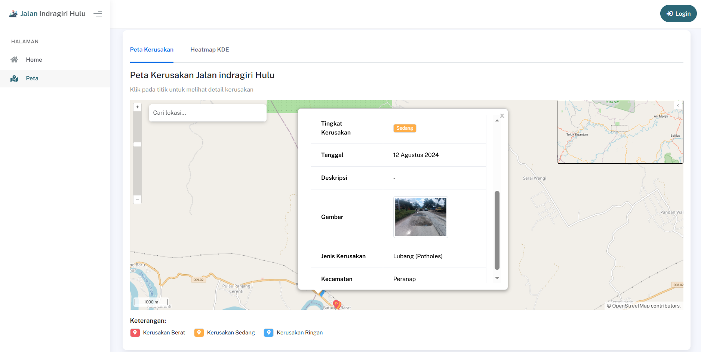
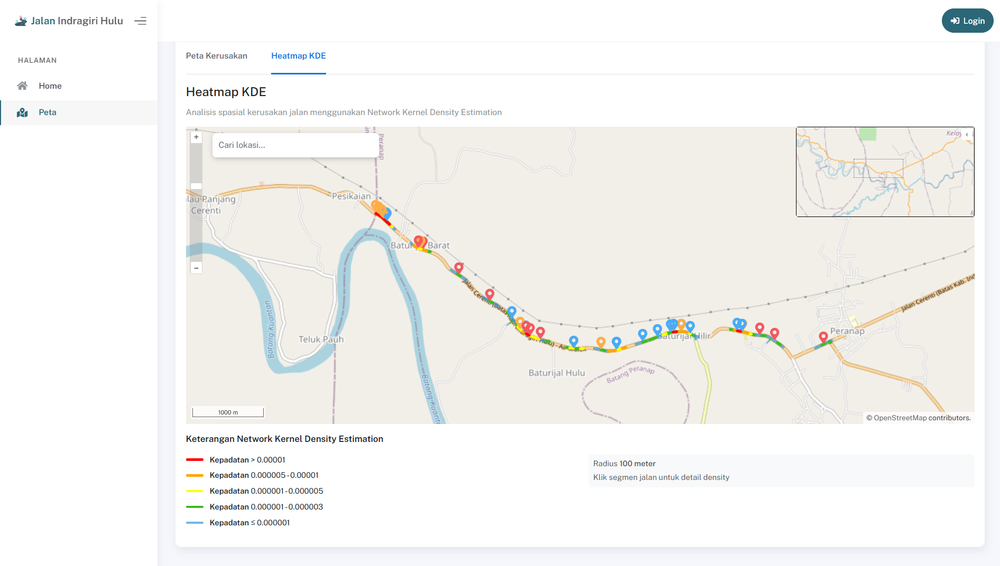

# Sistem Informasi Geografis Pemetaan Kerusakan Jalan




> Aplikasi web GIS untuk memetakan dan menganalisis tingkat kerusakan jalan di Kabupaten Indragiri Hulu. Menerapkan algoritma **Network Kernel Density Estimation (NKDE)** untuk visualisasi heatmap kepadatan kerusakan jalan.

---

## 🚀 Tech Stack
- **Framework:** Laravel 11 (PHP 8.2)
- **Database:** PostgreSQL + PostGIS Extension
- **Spatial Lib:** laravel-eloquent-spatial
- **Map:** OpenLayers
- **Styling:** Bootstrap 5

## 🛠️ Features
- 🗺️ **Interactive Mapping:** Visualisasi titik kerusakan jalan melalui peta digital.
- 📊 **Spatial Analysis:** Implementasi algoritma **NKDE** untuk heatmap kepadatan kerusakan.
- 📱 **Fully Responsive:** Tampilan responsif yang optimal untuk penggunaan di lapangan.
- ⚡ **High Performance:** Query spasial yang dioptimalkan menggunakan Index PostGIS.

## 📸 Gallery

> *Visualisasi heatmap kepadatan kerusakan jalan hasil perhitungan NKDE.*

---

## 💻 Installation (Local)
1. **Clone Repository**
   ```bash
   git clone https://github.com/rizkiyusra/gis-road-map.git   
   ```
2. **Setup Database**
   Pastikan PostgreSQL sudah terinstall dan jalankan query ini:
   ```sql
   CREATE EXTENSION postgis;
   ```
3. **Run Application**
   ```bash
   composer install
   php artisan migrate
   php artisan serve
   ```

---

## 📫 Connect with Me
- Portfolio: [Rizki Maulana Yusra](https://rizki-maulana-portfolio.vercel.app/)
- LinkedIn: [Rizki Maulana Yusra](https://www.linkedin.com/in/rizki-maulana-yusra/)

© 2026 **Rizki Maulana Yusra**.
